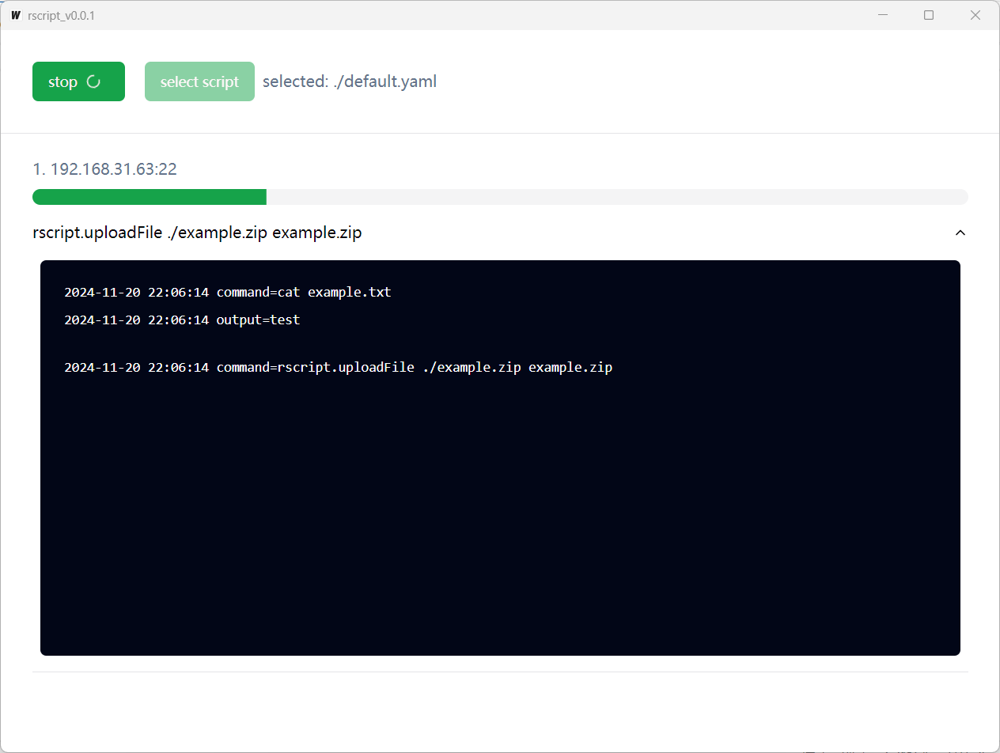

# rscript

rscript 是一个通过 ssh 远程执行命令的工具，命令和 ssh 连接信息保存在 yaml 文件中，目的是简化边缘场景下的运维过程。

## 快速开始

### 通过 gui/tui 执行

step 1: 编写脚本 [example script](example/example.yaml)，不同的是 rscript 提供了文件上传、下载、本地命令调用的功能

step 2: 运行 rscript_gui / rscript_tui ，选择脚本执行

### rscript package

rscript package 的作用是通过 go embed 将资源文件和脚本文件嵌入到 rscript tui 程序，制作成单一执行文件。

step 1: git clone https://github.com/leijux/rscript.git

step 2: internal/app/package 编写脚本

step 3: 编译包 go build -ldflags "-s -w" -o example.exe

## 为什么会诞生这个项目？

apt、docker 等是更好的解决方案，但有时程序可能部署在边缘场景下（有限的资源，无网络，甚至只能点对点访问）

同时来源于一个需求，如何在 windows 中双击运行来安装或升级 linux 中的程序 ;-)
